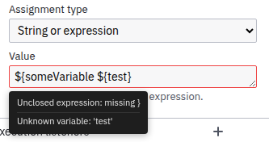

# Camunda Expression Assist

A JUEL expression validation plugin for [Camunda Modeler](https://github.com/camunda/camunda-modeler) targeting **Camunda 7**.

Validates `${...}` and `#{...}` expressions in the properties panel on the fly, highlighting syntax errors and unknown variables with inline feedback and hover tooltips.

<p align="center">
  
</p>

## Features

- **Syntax validation** — catches unclosed braces, missing operands, invalid operators, and other JUEL parse errors
- **Unknown variable detection** — cross-references variable names against upstream declarations from the [Variable Picker](../variable-picker) plugin
- **Typo suggestions** — suggests similar variable names for likely typos (Levenshtein distance matching)
- **Inline indicators** — red input border for syntax errors, orange for unknown variables
- **Hover tooltips** — detailed error messages on mouse hover
- **Full EL 2.2 / JUEL 2.2.7 grammar** — supports all operators, method calls, SPIN chains, ternary expressions, scientific notation, and mixed text + expression fields
- **Built-in awareness** — recognizes Camunda builtins (`execution`, `task`, `S`, `XML`, `Math`, etc.) without flagging them as unknown

## How It Works

The plugin attaches to all expression input fields in the properties panel via a MutationObserver. When a field loses focus, it:

1. Extracts all `${...}` / `#{...}` blocks from the field value
2. Parses each with a [Peggy](https://peggyjs.org/)-generated JUEL parser
3. Walks the AST to collect variable references
4. Cross-references against variables discovered by the Variable Picker's scanner
5. Displays diagnostics inline with hover tooltips

## Requirements

- Camunda Modeler with Camunda 7 platform
- [Variable Picker](https://github.com/knobik/camunda-variable-picker) plugin (for variable cross-referencing; syntax validation works without it)

## Installation

1. Clone or download this repository into your Camunda Modeler plugins directory:
   ```
   camunda-modeler/resources/plugins/expression-assist
   ```

2. Install dependencies and build:
   ```bash
   npm install
   npm run build
   ```

3. Restart Camunda Modeler.

## Development

```bash
npm install
npm run watch   # rebuild on changes (auto-reloads modeler)
```

## Testing

```bash
npm test          # run all tests
npm run test:watch  # watch mode
```

Tests cover the JUEL parser grammar (55 cases) and the validator logic (28 cases) including syntax validation, variable cross-referencing, and typo detection.

## License

[MIT](LICENSE)
